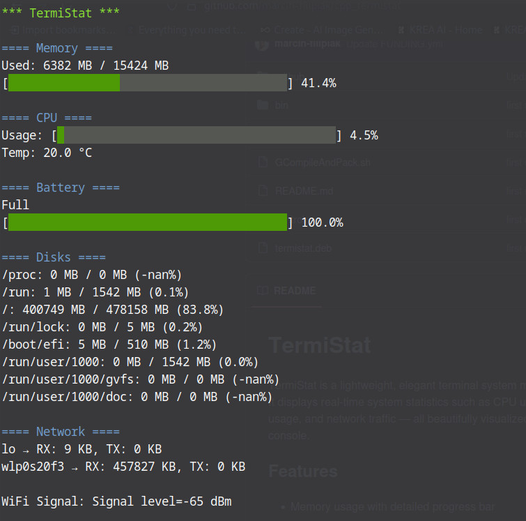

# TermiStat

TermiStat is a lightweight, elegant terminal system monitor for Linux (Debian and similar).  
It displays real-time system statistics such as CPU usage and temperature, memory usage, battery status, disk usage, and network traffic — all beautifully visualized with colored progress bars and clean layout, directly in the console.

## Features

- Memory usage with detailed progress bar  
- CPU load, temperature, and fan RPM (if available)  
- Battery charge and status with color-coded progress bar  
- Disk usage statistics for mounted partitions  
- Network RX/TX data and WiFi signal strength  
- Live updating every second  
- Clean, colorized output with no external dependencies  
